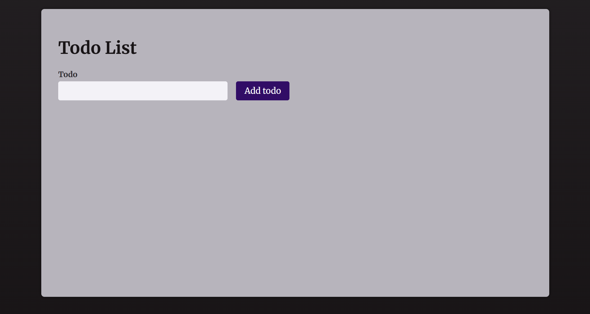
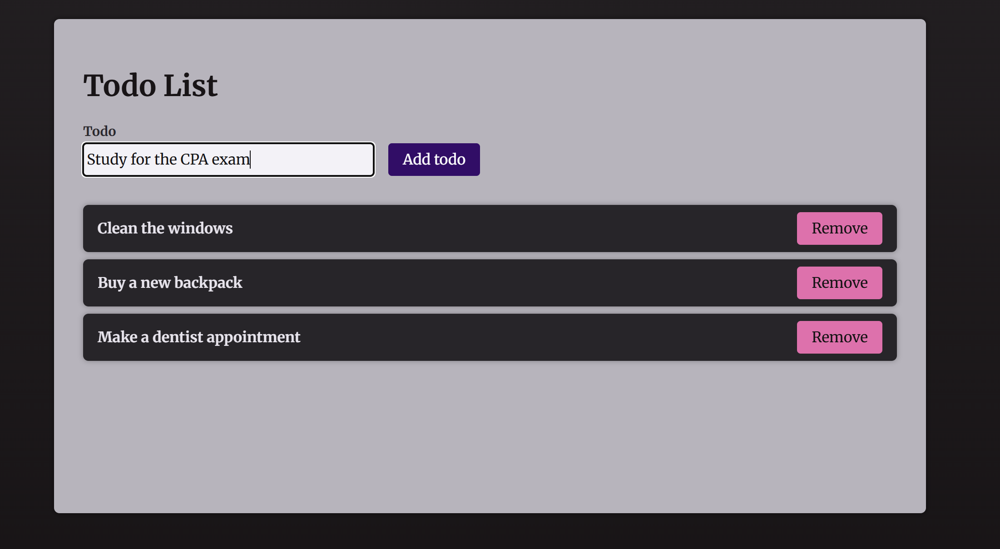

# TODO LIST

Simple todo list app. You can add and delete items in the list.

### Here's a picture of the app when it first starts up




### Sample of a completed todolist




## Getting Started

### Project setup

Make sure to install dependencies:

```bash
npm install
```

### Development Server

Start the development server on `http://localhost:3000`:

```bash
npm start
```

## Built With

- [HTMX](https://htmx.org/)
- [Express](https://expressjs.com/)

## Contributing

Pull requests are welcome. For major changes, please open an issue first to discuss what you would like to change.

## License

[MIT](https://choosealicense.com/licenses/mit/)

## Author

Garrett Chun - [![Github][1.1]][1] [![Twitter][1.2]][2]

[1.1]: ./src/assets/githubCat.png
[1.2]: ./src/assets/twitter20.png
[1]: https://github.com/KapakahiCoder
[2]: http://www.twitter.com/KapakahiCoder